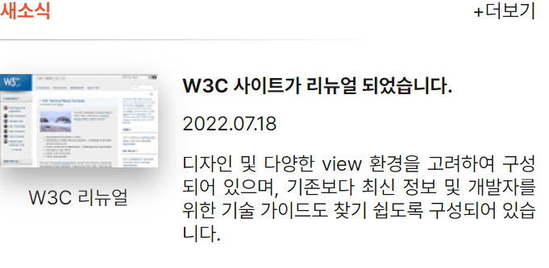

## Mission-04



- [Mission-04](#mission-04)
  - [html](#html)
  - [CSS](#css)
    - [접근성](#접근성)
    - [초기화](#초기화)
    - [뉴스 섹션](#뉴스-섹션)
    - [뉴스 타이틀](#뉴스-타이틀)
    - [더보기](#더보기)
    - [뉴스 게시물](#뉴스-게시물)
    - [뉴스 게시물 이미지, 캡션](#뉴스-게시물-이미지-캡션)

### html

- 클래스 네이밍은 최대한 BEM 형식으로 함
- 시맨틱 태그 main > section 태그 사용
```
<main>
  <section class="news">
  <!-- ... -->
  </section>
<main>
```

- section 태그에 제목으로 h3 태그 삽입
- 더보기 구현 위해 앵커 태그 사용
```
<h3 class="newsTitle">새소식</h3>
<a href="/" class="plusNews">+더보기</a>
```

- 게시글 제목, 게시 날짜, 내용 구현 위해 ul li 태그 사용, 링크 태그 삽입
```
  <ul class="news__ul">
    <li class="news_title">
      <a href="https://www.w3.org/">W3C 사이트가 리뉴얼 되었습니다.</a>
    </li>
    <!-- ... -->
  </ul>
```

- 섬네일 이미지, 설명 위해 figure 태그 사용
- 그 안에 img 태그와 설명 위한 figcaption 태그 사용
- 접근성 위해 alt 요소 추가
```
  <figure class="news__figure">
    
    <figcaption class="imgCaption">W3C 리뉴얼</figcaption>
  </figure>
```


### CSS

#### 접근성
```
.a11yHidden,
legend {
  overflow: hidden;
  position: absolute !important;
  clip: rect(0, 0, 0, 0);
  clip-path: inset(50%);
  width: 1px;
  height: 1px;
  margin: -1px;
}
```

#### 초기화
- 폰트
- 패딩, 마진 0
- li 스타일 제거
- a 태그 스타일 설정
```
body {
  font: inherit;
  font-family: Pretendard, -apple-system, BlinkMacSystemFont, system-ui, Roboto,
    "Helvetica Neue", "Segoe UI", "Apple SD Gothic Neo", "Noto Sans KR",
    "Malgun Gothic", "Apple Color Emoji", "Segoe UI Emoji", "Segoe UI Symbol",
    sans-serif;
  font-size: 14px;
  color: #181818;
}

body, ul, h3, figure {
  padding: 0;
  margin: 0;
}

ul li {
  list-style-type : none;
}

a {
  text-decoration: none;
  color: #181818;
  display: block;
}
```

#### 뉴스 섹션

- 레이아웃 위해 grid 값 적용
- column 10개로 간격 나눔
- gap은 row로만 12px 줌(ul와 figure 사이 패딩 값)
```
.news {
  width: 380px;
  display: grid;
  grid-template-columns: repeat(10, 1fr);
  grid-template-rows: auto;
  row-gap: 12px;
}
```

#### 뉴스 타이틀

- 패딩, 마진 bottom으로 시안대로 간격 넓힘
- border 태그들로 border에 그래디언트 값 적용
- grid 값 주어 첫 줄 좌측 80% 차지하도록 함.
```
/* 뉴스 타이틀 */
.newsTitle {
  font-size: 14px;
  color: #ED552F;
  padding-bottom: 12px;
  margin-bottom: 12px;
  box-sizing: border-box;
  border-bottom: 1px solid;
  border-image:linear-gradient(to right, #A9A9A9 0%, #fff 100%);
  border-image-slice: 1;
  grid-area: 1 / 1 / 2 / 8;
}
```

#### 더보기

- 첫 줄 우측 20% 차지하도록 함
- text-align right 값으로 우측 정렬되도록 함
  
```
/* 더보기 */
.plusNews {
  text-align: right;
  grid-area: 1 / 9 / 2 / 11;
}
```

#### 뉴스 게시물

- ul에 grid 값으로 우측 70% 공간 차지하도록 함
- text-align justify로 텍스트 정렬
- 패딩으로 각 요소 사이 간격 줌
  
```
/* 뉴스 게시물 */
.news__ul {
  grid-area: 2 / 4 / 3 / 11;
  text-align: justify;
  padding-left: 15px;
}

.news_title {
  font-weight: bold;
  padding-bottom: 10px;
}

.news_date {
  padding-bottom: 12px;
}
```

#### 뉴스 게시물 이미지, 캡션

- figure에 grid 값 주어 좌측 30% 차지하도록 함
- 이미지에 filter drop-shadow로 그림자 효과 줌
- 캡션에 패딩과 마진으로 간격 맞춤

```
/* 뉴스 게시물 이미지, 캡션 */
.news__figure {
  grid-area: 2 / 1 / 3 / 4;
}

.news__img {
  filter: drop-shadow(0px 10px 10px #aaa);
}

.imgCaption {
  padding-left: 20px;
  margin-top: 10px;
}
```