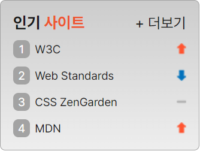

## Mission-05



- [Mission-05](#mission-05)
  - [html](#html)
  - [CSS](#css)
    - [접근성](#접근성)
    - [초기화](#초기화)
    - [사이트 섹션](#사이트-섹션)
    - [더보기](#더보기)
    - [숫자 스타일](#숫자-스타일)
    - [목록](#목록)
    - [스프라이트 이미지](#스프라이트-이미지)


### html

- 클래스 네이밍은 최대한 BEM 형식으로 함
- 시맨틱 태그 aside > section 태그 사용
```
<aside>
  <section class="hot">
  <!-- ... -->
  </section>
<aside>
```

- section 태그에 제목으로 h3 태그 삽입
- 부분 색깔을 주기 위해 span 태그로 묶음
```
<h3 class="hotTitle">
  인기 <span class="hotTitle__span">사이트</span>
</h3>
```

- 인기 사이트 목록 순위 구현 위해 ol li 태그 사용, 링크 태그 삽입
- sprite 이미지 넣기 위해 span 태그 삽입
```
  <ol class="hot__lists">
    <li class="sprite spriteUp">
      <a href="https://www.w3.org/"><span class="number">1</span> W3C</a>
    </li>
    <!-- ... -->
  </ol>
```

### CSS

#### 접근성
```
.a11yHidden,
legend {
  overflow: hidden;
  position: absolute !important;
  clip: rect(0, 0, 0, 0);
  clip-path: inset(50%);
  width: 1px;
  height: 1px;
  margin: -1px;
}
```

#### 초기화
- 폰트
- 패딩, 마진 0
- li 스타일 제거
- a 태그 스타일 설정
- 링크 눈에 잘 띄기 위해 hover 시 bold 설정
```
body {
  font: inherit;
  font-family: Pretendard, -apple-system, BlinkMacSystemFont, system-ui, Roboto,
    "Helvetica Neue", "Segoe UI", "Apple SD Gothic Neo", "Noto Sans KR",
    "Malgun Gothic", "Apple Color Emoji", "Segoe UI Emoji", "Segoe UI Symbol",
    sans-serif;
  font-size: 14px;
  color: #181818;
}

body, ol, h3 {
  padding: 0;
  margin: 0;
}

ol li {
  list-style-type : none;
}

a {
  text-decoration: none;
  color: #181818;
  display: block;
}

a:hover {
  font-weight: bold;
}
```

#### 사이트 섹션
- 너비, 배경 그래디언트, 패딩 설정
- 제목 폰트 사이즈 변경 및 일부 특정 색상 설정
- 더보기 위치 설정 위해 position relative 설정
```
.hot {
  width: 190px;
  background: linear-gradient(#CCC, #EEE);
  padding: 12px;
  box-sizing: border-box;
  border: 1px solid #A3A3A3;
  border-radius: 5px;
  position: relative;
}

.hotTitle {
  padding-bottom: 8px;
  font-size: 15px;
}

.hotTitle__span {
  color: #ED552F;
}
```

#### 더보기
- 더보기 position absolute와 top right 값으로 위치 조정
```
.plusHot {
  position: absolute;
  top: 13px;
  right: 12px;
}
```

#### 숫자 스타일
- span 요소인 순위에 스타일 주기 위해 inline-block 설정하고 너비 설정
- text-align으로 정렬, 패딩 top bottom으로 정렬 
```
.number {
  display: inline-block;
  color: #fff;
  width: 16px;
  background-color: #A3A3A3;
  border-radius: 5px;
  text-align: center;
  padding: 2px 0;
  margin-right: 2px;
}
```

#### 목록
- 폰트 크기, 목록 간격 조정
```
.hot__lists li {
  padding-bottom: 8px;
  font-size: 11px;
}

.hot__lists li:last-child {
  padding-bottom: 0;
}
```

#### 스프라이트 이미지
- 각 li에 스프라이트 이미지 배경 부여
- 해당 이미지에 맞게 position으로 간격 조절
```
.sprite {
  background: url(./image/rank.png) no-repeat;
}

.spriteUp {
  background-position: right 3px;
}

.spriteSame {
  background-position: right -18.5px;
}

.spriteDown {
  background-position: right -41.5px;
}
```